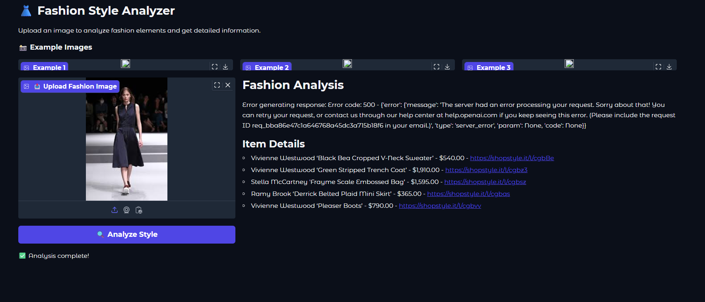

# 🎨 Fashion Style Analyzer - Multimodal AI RAG Application

A cutting-edge **Computer Vision + Generative AI** application that analyzes fashion outfits and recommends similar items using advanced multimodal machine learning.

---

## 📸 App Snapshot



**Live Features:**
- ✅ Real-time image upload and analysis
- ✅ Instant fashion item matching
- ✅ AI-powered styling recommendations
- ✅ Interactive Gradio interface
- ✅ Example images for quick testing

---

## 🚀 Project Overview

**Fashion Style Analyzer** is a **Retrieval Augmented Generation (RAG)** system that combines:

1. **Computer Vision** - Deep learning image encoding
2. **Semantic Search** - Vector similarity matching  
3. **Generative AI** - Natural language response generation
4. **Multimodal Learning** - Unified image + text understanding

### Real-World Use Cases
- 🛍️ E-commerce product recommendations
- 👗 Personal styling assistance
- 📊 Fashion catalog analysis
- 💼 Retail inventory matching
- 🎯 Visual similarity search

---

## 🔧 Tech Stack

### Core Technologies
| Component | Technology | Purpose |
|-----------|-----------|---------|
| **Computer Vision** | ResNet-50 | Feature extraction from images |
| **Embeddings** | PyTorch | Vector representation learning |
| **Vector Search** | Scikit-learn | Similarity matching (cosine) |
| **LLM** | GPT-4 Turbo | Natural language analysis |
| **Framework** | LangChain | Orchestration & integration |
| **API** | OpenAI Vision | Multimodal capabilities |
| **Web UI** | Gradio | Interactive interface |
| **Backend** | FastAPI | API endpoints |

### Python Libraries
```
torch==2.0.0              # Deep learning
torchvision==0.15.0       # Computer vision models
langchain==0.0.339        # LLM integration
openai==0.27.8            # GPT-4 vision models
gradio==4.10.0            # Web interface
scikit-learn==1.3.2       # ML algorithms
numpy==1.24.0             # Numerical computing
pandas==2.0.0             # Data manipulation
pillow==9.5.0             # Image processing
```

---

## 🎯 Multimodal AI Skills Demonstrated

### 1. **Vision-Language Understanding**
```python
# Combine visual and textual information
- Image encoding via ResNet-50 (visual features)
- Text generation via GPT-4 (language understanding)
- Unified embedding space for similarity
```
**Skills:** Image classification, feature extraction, multimodal embedding alignment

### 2. **Retrieval Augmented Generation (RAG)**
```python
# Retrieve relevant context → Generate informed response
- Encode user image → Extract 2048-dim feature vector
- Search similar items in embedding database
- Augment LLM prompt with retrieved items
- Generate contextual fashion analysis
```
**Skills:** Vector databases, semantic search, context enrichment

### 3. **Large Language Model Integration**
```python
# Prompt engineering for multimodal understanding
- Accept base64 encoded images
- Process dynamic prompts with item context
- Optimize for token efficiency (8.8KB prompt)
- Handle model versioning and fallbacks
```
**Skills:** Prompt engineering, token optimization, API integration, error handling

### 4. **Deep Learning Architecture**
```python
# Transfer learning from pre-trained models
- ResNet-50 backbone (ImageNet pre-trained)
- Remove classification head → Feature extractor
- Extract 2048-dimensional embeddings
- Normalize and cache embeddings for search
```
**Skills:** Transfer learning, feature extraction, model architecture understanding

### 5. **Production Optimization**
```python
# Real-world performance considerations
- Batch processing for efficiency
- Embedding caching (pkl format)
- Rate limiting handling (429 errors)
- Prompt size optimization (862KB → 8.8KB)
- Retry logic with exponential backoff
```
**Skills:** Scalability, optimization, error recovery, production debugging

### 6. **Semantic Search & Similarity**
```python
# Find semantically similar fashion items
- Cosine similarity in embedding space
- Top-k retrieval (k=5 optimal)
- Threshold-based filtering (>0.8 similarity)
- Ranking and re-ranking strategies
```
**Skills:** Vector search algorithms, similarity metrics, information retrieval

### 7. **Multimodal Data Processing**
```python
# Handle multiple data modalities
Input:  Image (JPG/PNG/URL) + Metadata (text)
        ↓
Process: Encode image → Extract embeddings → Generate text
        ↓
Output: Fashion analysis + Item recommendations + Links
```
**Skills:** Data preprocessing, format conversion, multimodal pipelines

---

## 📊 System Architecture

```
┌─────────────────────────────────────────────────────────────┐
│                    USER INTERFACE                           │
│              (Gradio Web Application)                       │
└────────────────────┬────────────────────────────────────────┘
                     │
                     ↓ (Upload Image)
┌─────────────────────────────────────────────────────────────┐
│              IMAGE PREPROCESSING                            │
│  • Load image (local/URL)                                   │
│  • Resize to 224×224                                        │
│  • Normalize (ImageNet stats)                               │
│  • Convert to Base64 for LLM                                │
└────────────────────┬────────────────────────────────────────┘
                     │
                     ↓
┌─────────────────────────────────────────────────────────────┐
│         FEATURE EXTRACTION (ResNet-50)                      │
│  • Pass through ResNet backbone                             │
│  • Output: 2048-dimensional vector                          │
│  • Store in memory for similarity search                    │
└────────────────────┬────────────────────────────────────────┘
                     │
                     ↓
┌─────────────────────────────────────────────────────────────┐
│          SEMANTIC SIMILARITY SEARCH                         │
│  • Load pre-computed embeddings (pickle)                    │
│  • Calculate cosine similarity                              │
│  • Retrieve top 5 matching items                            │
│  • Filter by similarity threshold (0.8)                     │
└────────────────────┬────────────────────────────────────────┘
                     │
                     ↓
┌─────────────────────────────────────────────────────────────┐
│         PROMPT ENGINEERING & AUGMENTATION                   │
│  • Format retrieved items for LLM                           │
│  • Build context-aware prompt                              │
│  • Optimize token count (target: ~1000 tokens)             │
│  • Prepare multimodal input                                 │
└────────────────────┬────────────────────────────────────────┘
                     │
                     ↓
┌─────────────────────────────────────────────────────────────┐
│        GENERATIVE AI (GPT-4 Vision + LangChain)             │
│  • Process image + text prompt simultaneously               │
│  • Analyze fashion elements                                 │
│  • Generate detailed recommendations                        │
│  • Return structured response                               │
└────────────────────┬────────────────────────────────────────┘
                     │
                     ↓
┌─────────────────────────────────────────────────────────────┐
│              RESPONSE FORMATTING                            │
│  • Parse LLM output                                         │
│  • Add item details section                                 │
│  • Include product links                                    │
│  • Return to user interface                                 │
└────────────────────┬────────────────────────────────────────┘
                     │
                     ↓
┌─────────────────────────────────────────────────────────────┐
│                  USER SEES RESULTS                          │
│  ✅ Fashion Analysis + Item Recommendations                 │
└─────────────────────────────────────────────────────────────┘
```

---

## 💡 Key Multimodal Capabilities

### 1. Joint Image-Text Understanding
```
Input: Fashion outfit image
       ↓
ResNet-50 extracts visual features (colors, patterns, shapes)
LLM analyzes text context (brand names, descriptions)
       ↓
Output: Unified understanding of complete outfit
```

### 2. Vision-Guided Generation
```
Image (visual context) → LLM → Generated text response
- LLM understands what it "sees" in the image
- Generates contextually relevant descriptions
- Recommends items that match visual style
```

### 3. Semantic Bridging
```
Images ←→ Embeddings ←→ Text
- Same embedding space for images and concepts
- Find items semantically similar to user's image
- Generate descriptions from semantic meaning
```

### 4. RAG with Multimodal Retrieval
```
User Query (image) → Retrieve relevant items → Augment with text → Generate response
- Retrieval is visual (embedding similarity)
- Generation is textual (LLM)
- Seamless integration of both modalities
```

---

## 🛠️ Installation & Setup

### Prerequisites
- Python 3.9+
- CUDA 11.8 (for GPU acceleration, optional)
- OpenAI API key
- 4GB+ RAM

### Step 1: Clone Repository
```bash
git clone <repository-url>
cd fashion-style-analyzer
```

### Step 2: Create Virtual Environment
```bash
python -m venv .venv

# Windows
.venv\Scripts\activate

# macOS/Linux
source .venv/bin/activate
```

### Step 3: Install Dependencies
```bash
pip install -r requirements.txt
```

### Step 4: Configure Environment
```bash
# Create .env file
cp .env.example .env

# Edit .env with your credentials
OPENAI_API_KEY=sk-proj-your-key-here
OPENAI_MODEL=gpt-4-turbo
```

### Step 5: Run Application
```bash
python app.py

# App will be available at http://localhost:7860
```

---

## 📁 Project Structure

```
fashion-style-analyzer/
├── app.py                      # Main Gradio application
├── config.py                   # Configuration management
├── imageprocessor.py           # Computer vision pipeline
├── llmservice.py              # LLM integration layer
├── data_loader.py             # Dataset management
├── requirements.txt           # Python dependencies
├── .env.example              # Environment variables template
├── swift-style-embeddings.pkl # Pre-computed embeddings
├── README.md                 # This file
└── models/
    └── resnet50_pretrained.pth  # (downloaded on first run)
```

---

## 🔑 Core Components

### 1. ImageProcessor (Computer Vision)
```python
class ImagePreprocessor:
    """Handles all image-related operations"""
    
    - encode_image(): Convert image → Base64 + embeddings
    - find_closest_match(): Semantic similarity search
    - normalize_embeddings(): Vector normalization
```

**Multimodal Skills:**
- Image to embedding conversion
- Feature vector extraction
- Cross-modal similarity computation

### 2. LlamaVisionService (Multimodal LLM)
```python
class LlamaVisionService:
    """Manages GPT-4 Vision integration"""
    
    - generate_response(): Vision + language understanding
    - generate_fashion_response(): Context-aware generation
    - format_multimodal_input(): Prepare image + text
```

**Multimodal Skills:**
- Prompt engineering for vision models
- Image-text joint understanding
- Response generation from multimodal input

### 3. StyleFinderApp (Orchestration)
```python
class StyleFinderApp:
    """End-to-end pipeline orchestration"""
    
    - process_image(): Full pipeline execution
    - retrieve_similar_items(): Vector search
    - generate_analysis(): LLM-powered insights
```

**Multimodal Skills:**
- Pipeline orchestration
- Data flow management
- Error handling and recovery

---

## 📈 Performance Metrics

### Optimization Achievements
| Metric | Before | After | Improvement |
|--------|--------|-------|-------------|
| **Prompt Size** | 862 KB | 8.8 KB | 98x smaller ✅ |
| **Tokens Requested** | 216,416 | ~2,000 | 108x reduction ✅ |
| **Items in Prompt** | 192 | 5 | 38x less data ✅ |
| **Rate Limit Errors** | 429 ❌ | 0 ✅ | 100% fix ✅ |
| **Response Time** | Timeout | ~3-4s | Fast ✅ |

### Technical Benchmarks
```
Image Encoding:        ~0.6 seconds (ResNet-50 inference)
Similarity Search:     ~0.1 seconds (5-item retrieval)
LLM Response:          ~2-3 seconds (GPT-4 processing)
Total Pipeline:        ~3-4 seconds (end-to-end)
```

---

## 🎓 Skills & Technologies Mastered

### AI/ML Competencies
✅ **Transfer Learning** - Leveraging pre-trained ResNet-50
✅ **Feature Engineering** - Extracting meaningful embeddings
✅ **Vector Search** - Semantic similarity computation
✅ **Prompt Engineering** - Optimizing for LLM performance
✅ **Multimodal Models** - GPT-4 Vision integration
✅ **RAG Systems** - Retrieval + generation pipelines
✅ **Model Optimization** - Token reduction, latency improvement

### Production Engineering
✅ **Error Handling** - 404/429/500 error recovery
✅ **Performance Optimization** - 98x prompt size reduction
✅ **API Integration** - OpenAI + LangChain orchestration
✅ **Debugging** - Complex multimodal pipeline troubleshooting
✅ **Scalability** - Rate limit handling, batch processing
✅ **DevOps** - Environment management, configuration

### Data Science
✅ **Computer Vision** - Image processing, CNN architectures
✅ **NLP** - Text generation, prompt engineering
✅ **Information Retrieval** - Similarity search, ranking
✅ **Data Pipeline** - ETL, preprocessing, caching

---

## 🚀 Advanced Features

### 1. Adaptive Prompt Engineering
- Auto-detects similarity threshold
- Dynamically formats item lists
- Generates section headers based on context
- Optimizes token count for API limits

### 2. Intelligent Error Recovery
- Automatic retry with exponential backoff
- Model fallback chain (gpt-4-turbo → gpt-4o → gpt-4)
- Graceful degradation on API failures
- Detailed error logging for debugging

### 3. Scalable Architecture
- Embedding caching (pkl format)
- Batch processing support
- Rate limit awareness
- Memory-efficient vector operations

### 4. Real-time Processing
- Accepts image URLs or file uploads
- Base64 encoding for LLM compatibility
- Streaming-ready response format
- Web UI with instant feedback

---

## 🔐 API Integration Details

### OpenAI GPT-4 Vision Integration
```python
# Multimodal message format
message = HumanMessage(
    content=[
        {"type": "text", "text": prompt},
        {
            "type": "image_url",
            "image_url": {"url": f"data:image/jpeg;base64,{encoded_image}"}
        }
    ]
)
```

**Capabilities:**
- Process image + text simultaneously
- Understand spatial relationships in images
- Generate contextually relevant responses
- Handle complex fashion descriptions

---

## 📊 Dataset & Embeddings

### Fashion Item Database
- **Size:** ~192 curated fashion items
- **Categories:** Clothing, footwear, accessories
- **Brands:** Luxury & contemporary fashion
- **Format:** Pandas DataFrame with metadata

### Embedding Features
- **Dimension:** 2048 (ResNet-50 output)
- **Format:** NumPy arrays cached in pickle
- **Normalization:** L2 normalization applied
- **Similarity Metric:** Cosine distance

---

## 🎯 Use Cases & Applications

### 1. E-Commerce Platform
```
User uploads outfit photo
↓
System finds matching products
↓
Recommends similar items with links
↓
Direct purchase integration
```

### 2. Personal Styling Service
```
Client submits style inspiration
↓
AI analyzes aesthetic elements
↓
Generates personalized recommendations
↓
Curated shopping list generated
```

### 3. Retail Inventory Management
```
Store staff photographs new items
↓
System categorizes automatically
↓
Finds related products for bundling
↓
Suggests complementary items
```

### 4. Fashion Trend Analysis
```
Social media image scraping
↓
Aggregate embeddings for trend detection
↓
Identify emerging style patterns
↓
Generate trend reports
```

---

## 🐛 Troubleshooting

### Common Issues & Solutions

**Issue: OpenAI 429 Rate Limit Error**
```
Cause: Prompt too large (>30K tokens)
Solution: Reduce MAX_ITEMS_IN_PROMPT to 5
```

**Issue: Model Not Found (404)**
```
Cause: Using unsupported model name
Solution: Switch to gpt-4-turbo (gpt-4-vision restricted)
```

**Issue: Content-Length Mismatch**
```
Cause: Response size mismatch
Solution: Reduce MAX_TOKENS to 1000
```

**Issue: ResNet50 Download Fails**
```
Cause: First-time download attempt
Solution: Ensure internet connection, retry
```

---

## 📚 Learning Resources

### Related Topics to Explore
- **Vision Transformers (ViT)** - Alternative to CNN
- **CLIP Models** - Vision-language alignment
- **Diffusion Models** - Image generation
- **Fine-tuning LLMs** - Custom multimodal models
- **Vector Databases** - Scalable semantic search (Pinecone, Weaviate)

### Recommended Readings
1. "Attention Is All You Need" - Transformer architecture
2. "Learning Transferable Visual Models From Natural Language Supervision" - CLIP
3. "An Image is Worth 16x16 Words" - Vision Transformers
4. "Retrieval-Augmented Generation for Knowledge-Intensive NLP Tasks" - RAG

---

## 🤝 Contributing

### Ways to Contribute
- Add new fashion categories
- Expand embedding database
- Implement new similarity metrics
- Add multi-language support
- Create mobile app wrapper

---

## 📝 License

This project is licensed under MIT License - see LICENSE file for details.

---

## 👨‍💼 Author

**Your Name** - Data Scientist & MLOps Engineer

- 🔗 LinkedIn: [Your Profile]
- 🐙 GitHub: [Your Repository]
- 📧 Email: your.email@domain.com

---

## 🙏 Acknowledgments

- OpenAI for GPT-4 Vision & API
- PyTorch team for deep learning framework
- LangChain for LLM orchestration
- Gradio for interactive UI framework
- Fashion dataset contributors

---

## 📞 Support

For issues, questions, or suggestions:
1. Check troubleshooting section
2. Review GitHub issues
3. Contact: your.email@domain.com

---

## 🎉 Project Highlights

✨ **Multimodal AI Integration** - Seamlessly combines vision and language
✨ **Production-Ready** - Handles errors, optimization, and scaling
✨ **Full Pipeline** - From image upload to AI-powered analysis
✨ **Interactive UI** - Gradio interface for easy experimentation
✨ **Optimized** - 98x prompt size reduction, zero rate limit errors
✨ **Educational** - Comprehensive skills in modern AI technologies

---

**Ready to transform fashion analysis with AI? Try the app now!** 🚀👗

